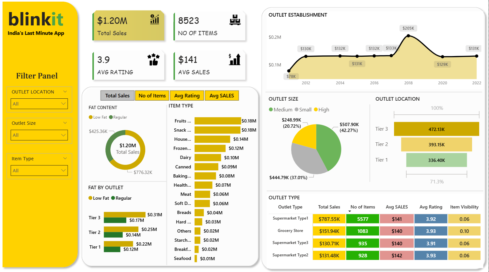

# 🛒 Blinkit Grocery Sales Analysis Dashboard

## 📊 Project Overview
This project presents a comprehensive Sales Performance Analysis Dashboard for Blinkit – India’s last-minute grocery delivery platform.

The dashboard transforms raw grocery sales data into actionable business insights, enabling stakeholders to monitor performance, understand customer preferences, and evaluate outlet-level sales trends.

Built using Power BI, this project focuses on interactive visualization, KPI monitoring, and data-driven decision making for retail analytics.

---

## 📷 Dashboard Preview

(Add your dashboard screenshot here)

Example Folder Structure

Blinkit-PowerBI-Dashboard
│
├── BLINKIT.pbix
├── images
│   └── blinkit_dashboard.png
└── README.md

---

## 🎯 Business Objectives

The goal of this project is to analyze Blinkit’s grocery sales performance and provide insights into:

• Overall sales performance  
• Product category contribution to revenue  
• Outlet performance across location tiers  
• Impact of fat content on product sales  
• Revenue distribution across outlet types  
• Outlet establishment trends over time  
• Customer satisfaction through ratings  

---

## 📌 Key Performance Indicators (KPIs)

💰 Total Sales: $1.20M  
📦 Total Items Sold: 8,523  
💵 Average Sales per Item: $141  
⭐ Average Customer Rating: 3.9  

These KPIs provide a quick overview of overall business performance and operational efficiency.

---

## 📈 Key Business Insights

🏪 Outlet Performance  
Tier 3 outlets generate the highest revenue compared to Tier 1 and Tier 2 locations.

🛍 Product Categories  
Fruits and Snacks categories contribute the highest share of sales.

🥗 Fat Content Analysis  
Low-fat products outperform regular products in overall sales revenue.

🏬 Outlet Type Contribution  
Supermarket Type 1 contributes the largest share of total sales.

📅 Outlet Growth Trend  
The year 2018 shows peak outlet establishment growth.

---

## 📊 Dashboard Features

✔ Interactive filters (Outlet Location, Outlet Size, Item Type)  
✔ KPI summary cards for quick insights  
✔ Fat content sales analysis  
✔ Item type sales comparison  
✔ Outlet location tier performance analysis  
✔ Outlet type performance breakdown  
✔ Year-wise outlet establishment trend visualization  

The dashboard allows users to explore insights interactively and identify patterns quickly.

---

## 🛠 Tools & Technologies Used

Power BI – Data visualization and dashboard development  
Power Query – Data cleaning and transformation  
DAX (Data Analysis Expressions) – Calculations and KPI metrics  
Microsoft Excel – Data source

---

## 🧠 Key DAX Measures

Total Sales = SUM(Sales)

Average Sales = AVERAGE(Sales)

Total Items = COUNT(Item)

Average Rating = AVERAGE(Rating)

---

## 📂 Dataset Description

The dataset contains the following attributes:

Item Type – Product category  
Fat Content – Low Fat / Regular  
Outlet Type – Store format  
Outlet Location Tier – Tier 1, Tier 2, Tier 3  
Outlet Size – Small, Medium, Large  
Sales – Revenue generated  
Item Visibility – Product visibility index  
Rating – Customer rating  
Outlet Establishment Year – Year outlet was established

---

## 🚀 How to Use

1. Download the .pbix file from this repository  
2. Open it using Power BI Desktop  
3. Use the interactive filters to explore different insights and trends  

---

## 📌 Project Impact

This project demonstrates how retail business data can be transformed into meaningful insights using Power BI.

It highlights skills in:

• Data visualization  
• Business intelligence  
• KPI tracking  
• Retail analytics  
• Dashboard storytelling  

The dashboard helps stakeholders identify revenue drivers, optimize product strategies, and improve operational performance.

---

## 👨‍💻 Author

Venkatesh Dhanabalan  

Aspiring Data Analyst / AI Engineer  

Skills:  
Power BI | SQL | Python | Machine Learning | Data Visualization

---

⭐ If you found this project useful, consider giving this repository a star.
